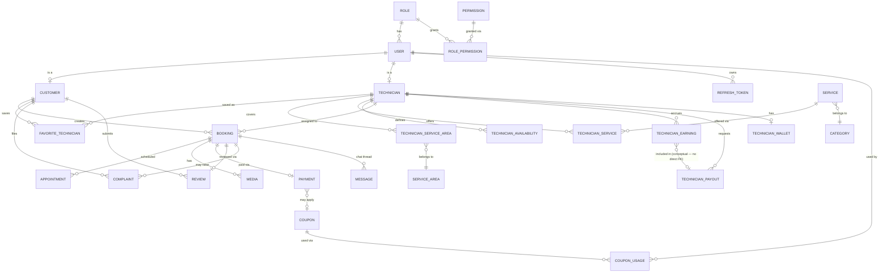

# Database Design

## Osta Plus Database Design & Entity Relationship Diagram (v4)

---

## Table of Contents

1. [Database Overview](#1-database-overview)
2. [Database Goals](#2-database-goals)
3. [Database Management System](#3-database-management-system)
4. [Database Architecture](#4-database-architecture)
5. [Naming Conventions](#5-naming-conventions)
6. [Entity Relationship Diagram](#6-entity-relationship-diagram)
7. [Entities by Module](#7-entities-by-module)
8. [Key Relationships](#8-key-relationships)
9. [Constraints & Data Integrity](#9-constraints--data-integrity)
10. [Performance Strategy](#10-performance-strategy)
11. [Security](#11-security)
12. [Backup & Recovery](#12-backup--recovery)
13. [Future Considerations](#13-future-considerations)

---

## 1. Database Overview

The Osta Plus platform uses **Microsoft SQL Server** as the primary relational database management system. The database follows a modular schema-based organization aligned with the solution's Clean Architecture / Modular Monolith structure.

---

## 2. Database Goals

- Maintain data consistency and integrity.
- Minimize data redundancy through normalization.
- Support efficient querying and indexing.
- Ensure scalability for future business growth.
- Support secure data storage.
- Simplify maintenance and future enhancements.

---

## 3. Database Management System

| Property | Value |
| --- | --- |
| Database Engine | Microsoft SQL Server |
| ORM | Entity Framework Core |
| Migration Tool | EF Core Migrations |
| Database Type | Relational Database |
| Primary Key Strategy | Identity (int) for domain tables; string (Identity `Id`) for user-linked tables |

---

## 4. Database Architecture

| Schema | Backing Project | DB Tables | API Exposure |
| --- | --- | --- | --- |
| Identity | `Osta.Identity` | ✅ Migrated | ✅ Exposed |
| Service | `Osta.Service` | ✅ Migrated | ✅ Exposed |
| Booking | `Osta.Booking` | ✅ Migrated (`Bookings`, `BookingServices`, `BookingStatusHistory`, `Media`) | ✅ Exposed |
| Appointment | `Osta.Booking` | ✅ Migrated (`Appointments`) | ✅ Exposed |
| Payment | `Osta.Payment` (adapter) + `Osta.Core` (persistence) | ✅ Migrated (`Payments`, `Coupons`, `CouponUsages`) | ✅ Exposed |
| Technician | `Osta.Service` | ✅ Migrated (`Technicians`, `TechnicianEarning`, `TechnicianPayout`, `TechnicianWallet`) | ✅ Exposed |
| Review | `Osta.Service` | ✅ Migrated (`Reviews`) | ✅ Exposed |
| Complaint | *(cross-cutting, Infrastructure)* | ✅ Migrated (`Complaints`) | ✅ Exposed |
| Chat | *(cross-cutting)* | ✅ Migrated (`Messages`) | ✅ Exposed (REST + SignalR Hub) |
| Notification | `Osta.Notification` | ✅ Migrated (`Notifications`) | ❌ Not exposed as REST (consumed asynchronously via RabbitMQ) |
| Admin | *(cross-cutting, Infrastructure)* | ✅ Migrated (`AuditLogs`, `SystemSettings`) | ❌ Not exposed |
| Support | *(no dedicated project yet)* | ✅ Migrated (`SupportTickets`) | ❌ Not exposed |

Shared entity/enum definitions (e.g. `BookingStatus`, `PaymentStatus`, `PayoutStatus`, `DiscountTypeEnum`) live in `Osta.Domain` so every schema's EF configuration references the same source of truth.

---

## 5. Naming Conventions

### Tables
- PascalCase, generally plural for transactional tables (`Payments`, `Coupons`, `CouponUsages`) and singular/plural mixed for legacy tables

### Primary Keys
```
Id
```

### Foreign Keys
```
UserId
BookingId
ServiceId
TechnicianId
CouponId
PayoutId
```

> **Exception:** Identity tables use ASP.NET Core Identity's default naming (`AspNetUsers`, `AspNetRoles`, `AspNetUserRoles`) — the framework default, not overridden.

### Indexes
- `Coupons.Code` — unique index
- `CouponUsages.(CouponId, UserId)` — unique composite index (prevents duplicate coupon use per customer)
- `Payments.TransactionId` — used for webhook lookup (Stripe PaymentIntent Id)
- Foreign keys, frequently-searched columns, authentication-related columns

---

## 6. Entity Relationship Diagram



> **Note:** `TechnicianPayout.Amount` is entered by the technician per payout request and is **not** currently linked 1:1 to specific `TechnicianEarning` rows via a foreign key — the available balance is computed as `SUM(TechnicianEarning.NetAmount) − SUM(TechnicianPayout.Amount WHERE Status IN (Pending, Completed))`.

---

## 7. Entities by Module

### 7.1 Identity (`Osta.Identity`)

| Entity | Table | Key Attributes |
| --- | --- | --- |
| User | `AspNetUsers` | Id, UserName, Email, PasswordHash, PhoneNumber, FullName, ExternalId (Google), Provider |
| Role | `AspNetRoles` | Id, Name, NormalizedName |
| RefreshToken | `RefreshTokens` | Id, UserId (FK), Token, ExpiresAt |
| Permission / RolePermission | `Permission`, `RolePermission` | Fine-grained RBAC backing the `Authorization` controller |

### 7.2 Technician (`Osta.Service`)

| Entity | Key Attributes |
| --- | --- |
| Technician | Id, UserId (FK), Bio, IsVerified, Status, NationalId, YearsOfExperience, Rating, TotalReviews, CompletedBookings |
| ServiceArea / TechnicianServiceArea | As before |
| TechnicianService | As before |
| TechnicianAvailability | As before |
| **TechnicianEarning** | Id, BookingId (FK), TechnicianId (FK), GrossAmount, PlatformFee, NetAmount, EarnedAt |
| **TechnicianPayout** | Id, TechnicianId (FK), Amount, Status (Pending/Approved/Rejected/Completed/Cancelled), Method (VodafoneCash/BankTransfer/InstaPay), ReceivingDetails, RequestedAt, CompletedAt, RejectionReason |
| **TechnicianWallet** | TechnicianId (FK), Amount *(current balance)* |

### 7.3 Booking (`Osta.Booking`)

| Entity | Key Attributes |
| --- | --- |
| Booking | Id, CustomerId (FK), TechnicianId (FK), Area, City, Governorate, Street, BookingDate, Status |
| **Appointment** | Id, BookingId (FK), ScheduledStart, ScheduledEnd, IsApproved, ReminderSent, Notes |
| Media | Id, BookingId (FK), Url, RepairType, CreatedAt |

### 7.4 Payment (`Osta.Payment` adapter + `Osta.Core` persistence)

| Entity | Table | Key Attributes |
| --- | --- | --- |
| Payment | `Payments` | Id, BookingId (FK), Amount, Status (Pending/Completed/Failed/Refunded), Method, TransactionId (Stripe PaymentIntent Id), CouponId (FK, nullable), CreatedAt |
| **Coupons** | `Coupons` | Id, Code (unique), DiscountType (Percentage/FixedAmount), DiscountValue, StartDate, EndDate, UsageLimit, UsedCount, IsActive, CreatedAt |
| **CouponUsage** | `CouponUsages` | Id, CouponId (FK), UserId (FK), BookingId (FK), UsedAt |

### 7.5 Review / Complaint / FavoriteTechnician / Chat

| Entity | Table | Key Attributes |
| --- | --- | --- |
| Review | `Reviews` | Id, BookingId (FK), CustomerId (FK), TechnicianId (FK), Rating, Comment |
| Complaint | `Complaints` | Id, BookingId (FK), CustomerId (FK), Description, Status |
| FavoriteTechnician | `FavoriteTechnicians` | CustomerId (FK), TechnicianId (FK) |
| Message | `Messages` | Id, BookingId (FK), SenderId (FK), Content, SentAt |

### 7.6 Notification (`Osta.Notification`)

| Entity | Table | Key Attributes |
| --- | --- | --- |
| Notification | `Notifications` | Id, UserId (FK), Message, IsRead, CreatedAt |

> Notification delivery for payout completion is currently driven by a RabbitMQ message (`PayoutNotification` DTO on the `payout-notification` queue) rather than a direct DB write from the API request path; the `Osta.Notification.Worker` consumer persists/sends it downstream.

### 7.7 Administration / Support *(cross-cutting, mostly unchanged)*

| Entity | Key Attributes |
| --- | --- |
| AuditLog | Id, UserId (FK), Action, Timestamp |
| SystemSetting | Id, Key, Value |
| SupportTicket | Id, UserId (FK), Subject, Description, Status |

---

## 8. Key Relationships

| Relationship | Cardinality |
| --- | --- |
| Role ↔ User / Role ↔ Permission | N ↔ N |
| User → Technician / User → Customer | 1 → 1 |
| Technician → TechnicianEarning | 1 → N |
| Technician → TechnicianPayout | 1 → N |
| Technician → TechnicianWallet | 1 → 1 |
| Booking → Appointment | 1 → N (in practice 1 → 0..1 per active schedule) |
| Booking → Payment | 1 → 0..1 |
| Payment → Coupon | N → 0..1 |
| Coupon → CouponUsage | 1 → N |
| CouponUsage → User | N → 1 |
| Booking → Review / Complaint / Message | 1 → 0..N |

---

## 9. Constraints & Data Integrity

- Primary Keys, Foreign Keys, Unique Constraints (`Coupons.Code`, `CouponUsages.(CouponId, UserId)`), Required Fields
- Referential Integrity, Transactions (via `IUnitOfWork.SaveChangesAsync`)
- Payment webhook processing runs inside a single transaction per event (Payment status update + Coupon usage recording + Earning creation)
- Business-rule-level integrity enforced in Command Handlers (not DB constraints): payout amount ≤ available balance, no overlapping technician appointments, coupon single-use per customer

---

## 10. Performance Strategy

- Proper Indexing (see §5)
- Query Optimization / Projection (`Select` into result DTOs rather than returning tracked entities)
- Pagination (Category, Technician)
- **Redis Distributed Caching** — implemented for `Category` and `Service` read endpoints (cache-aside pattern: read from Redis first, fall back to SQL Server on miss, invalidate the relevant cache key on create/update/delete)

---

## 11. Security

- Parameterized Queries via EF Core
- Role-Based Authorization (JWT + `[Authorize(Roles = ...)]`)
- Secure Password Storage via ASP.NET Identity
- Stripe webhook HMAC/signature verification before trusting payment events
- Audit Logging

---

## 12. Backup & Recovery

- Regular database backups.
- Disaster recovery planning.
- Restore procedures.

---

## 13. Future Considerations

| Entity | Purpose |
| --- | --- |
| DeviceToken | Push notification device tokens |
| ChatRoom (upgrade) | Real-time SignalR-backed chat sessions |
| TechnicianLocation | Live GPS tracking |
| RefreshTokenHistory | Track login/refresh-token history for auditing |

Other planned platform-level improvements:
- Webhook idempotency table (`ProcessedStripeEvents`) to guard against duplicate event delivery
- Database Partitioning / Read Replicas
- Redis caching layer
- Cloud Database Migration (AWS RDS)

---

**Document Version:** 4.0
**Status:** Draft — added Payment, Coupon, CouponUsage, TechnicianEarning, TechnicianPayout, TechnicianWallet, Appointment, Message schemas; corrected API exposure status across the board
