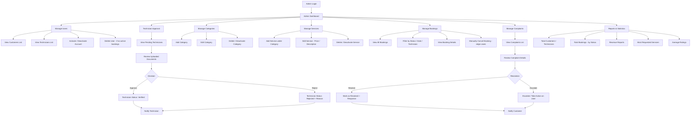

# Osta Platform – Admin Flow

توثيق لرحلة الـ Admin ومسؤولياته الأساسية في إدارة المنصة.

## 1. Flowchart

## 2. Notes / Business Rules

- الـ Admin هو المسؤول الوحيد عن اعتماد أو رفض حسابات الفنيين بناءً على المستندات المرفوعة (بطاقة الرقم القومي / رخصة / شهادات).
- مايقدرش يمسح فني أو عميل عنده Bookings نشطة (Active) — لازم الطلبات تخلص أو تتلغي الأول.
- إدارة التصنيفات (Categories) والخدمات (Services) هي الأساس اللي بيبني عليه الـ Customer اختياراته في الـ Browse Flow.
- الشكاوى (Complaints) بتتجمع من العملاء والفنيين، والـ Admin بيراجعها ويقرر يحلها مباشرة أو يصعّدها (زي إيقاف حساب فني مثلاً).
- الـ Reports & Statistics بتتغذى من بيانات الـ Bookings والـ Payments والـ Reviews، وممكن تتحدث بشكل Real-time أو عن طريق Background Job/Scheduled Job.
- ممكن لاحقًا تضاف صلاحية Sub-role زي "Support" يكون له صلاحيات محدودة (مثلاً Complaints بس) من غير Full Admin Access.
