# Osta Platform – Feature Flows (Mini Diagrams)

Flow مبسط وسريع لكل ميزة من المقترحات، لتوضيح الفكرة بس من غير تفاصيل زيادة.

---

## 1. Coupons & Discounts

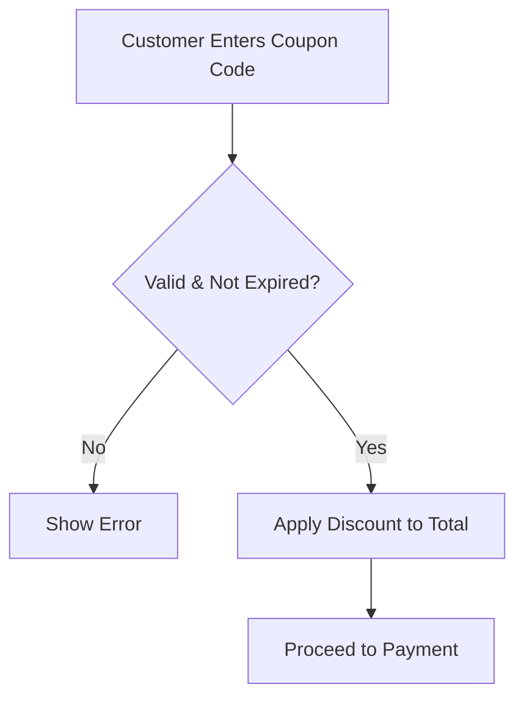

---

## 2. Favorites

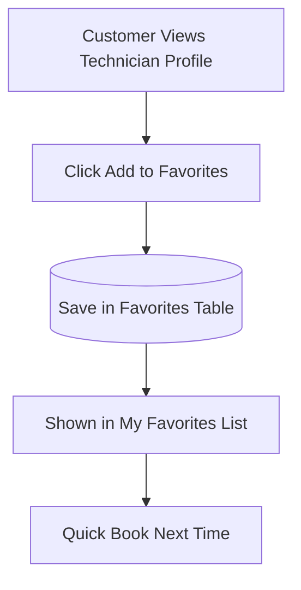

---

## 3. Push Notifications

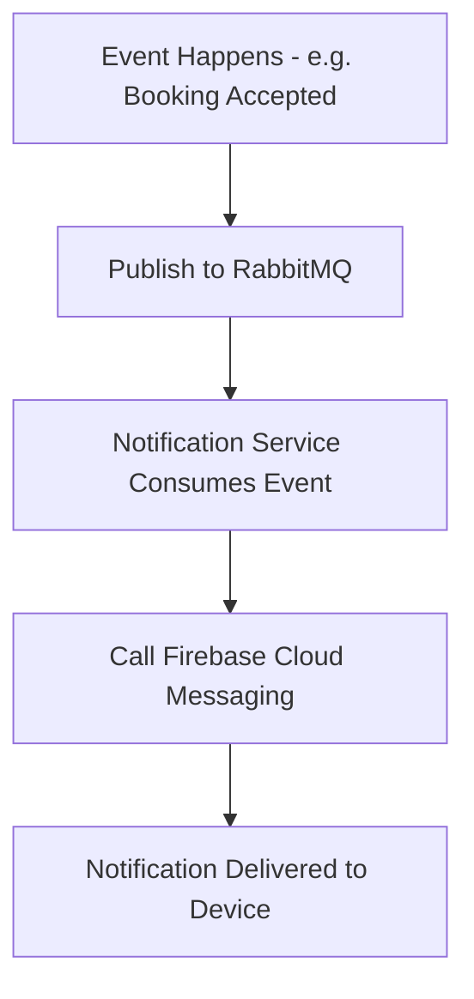

---

## 4. Localization (AR/EN)

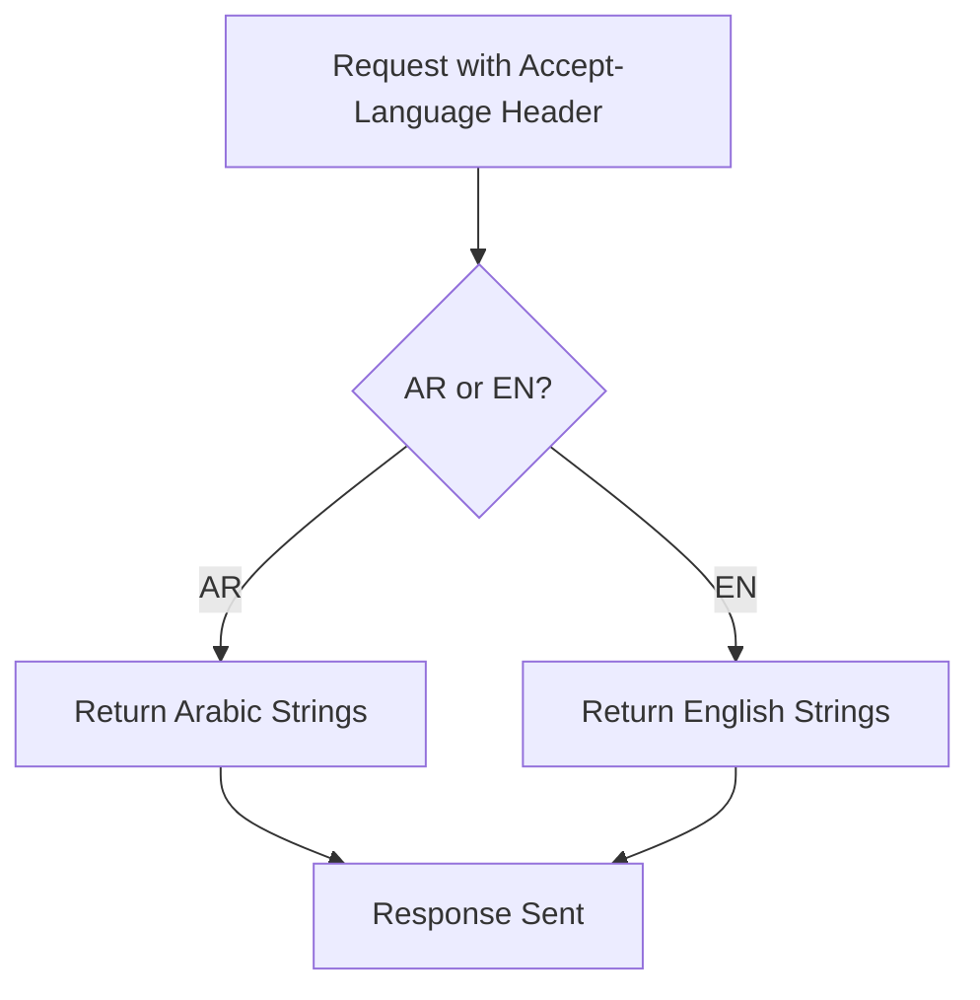

---

## 5. Real-time Chat (SignalR)

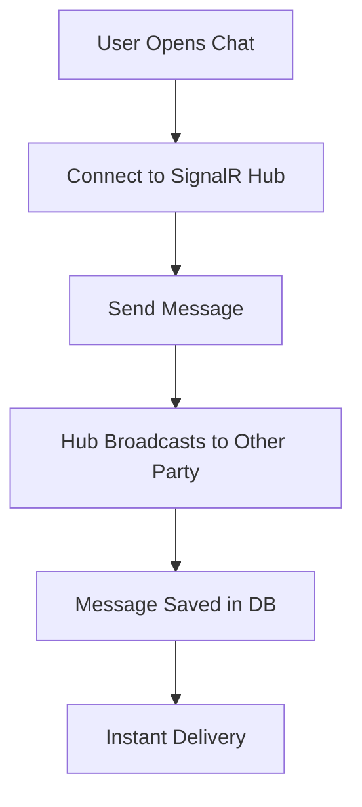

---

## 6. Live Tracking (Technician Location)

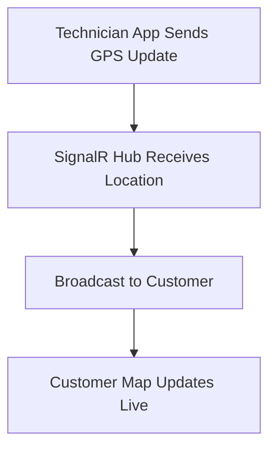

---

## 7. Recommendation Engine (Nearest Technician)

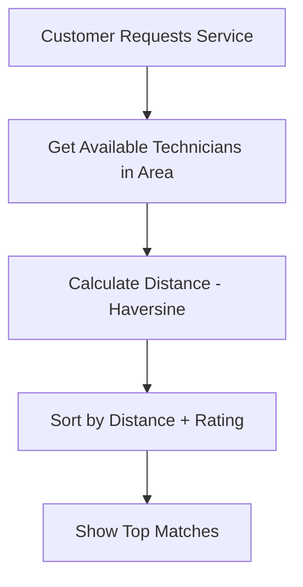

---

## 8. Wallet System

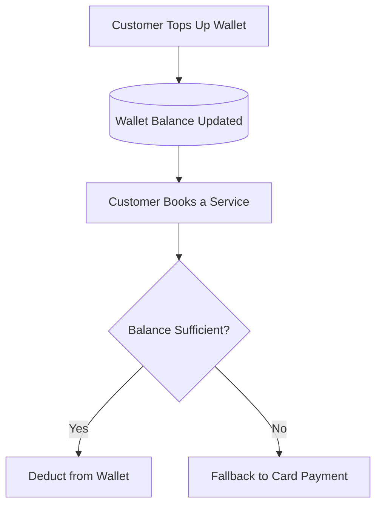

---

## 9. Redis Caching

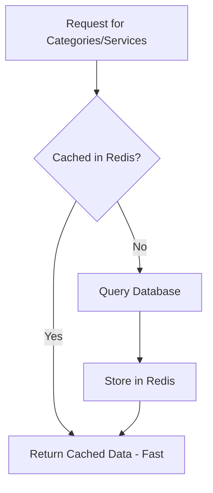

---

## 10. Outbox Pattern (Reliable Messaging)

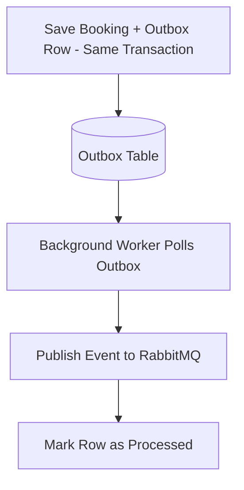

---

## 11. CI/CD Pipeline

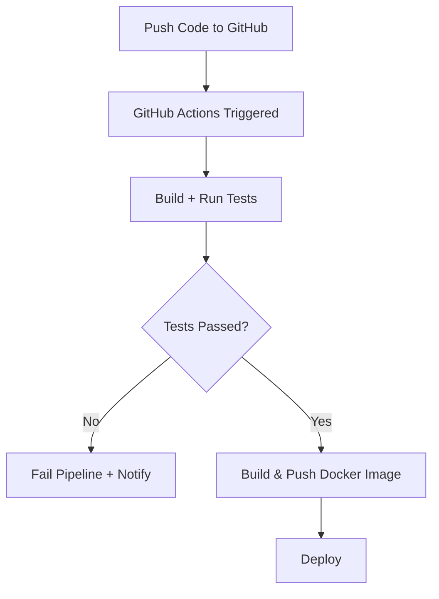

---

## 12. Rate Limiting / API Gateway

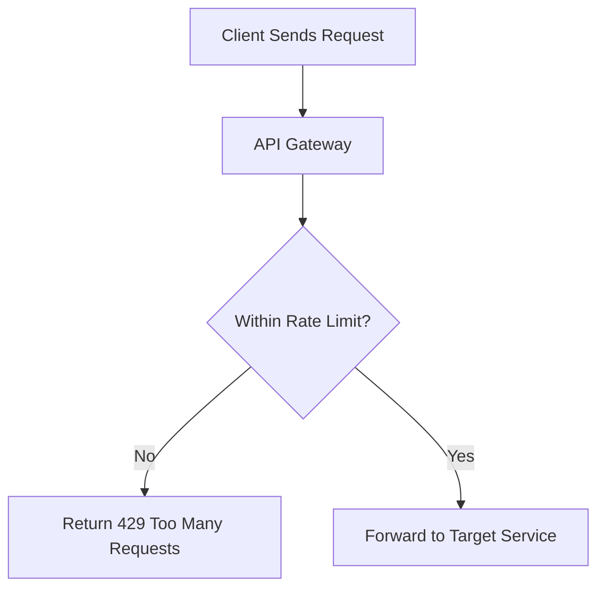

---

## 13. Background Jobs - Appointment Reminders (Hangfire)

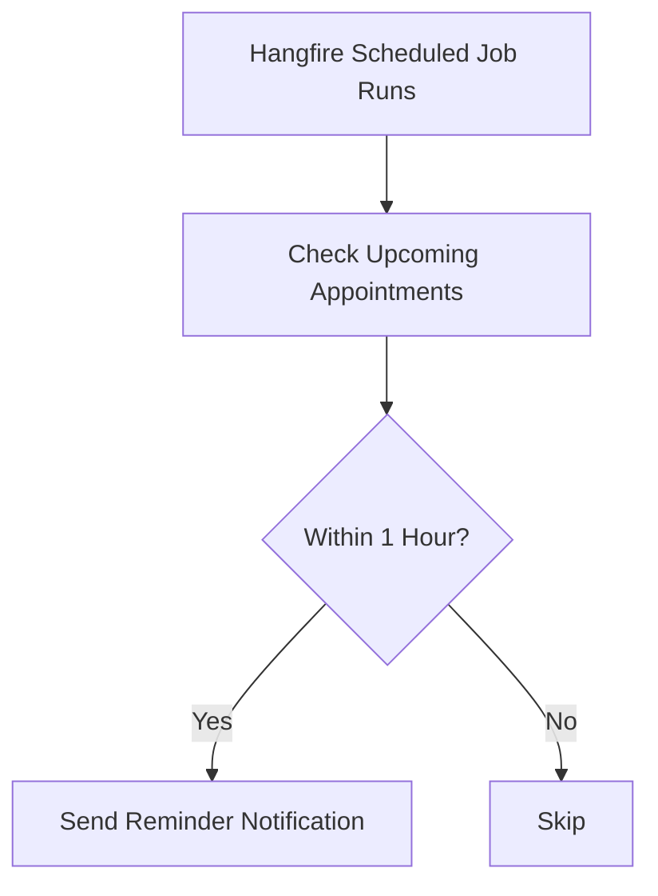

---

## 14. Gamification (Technician Badges)

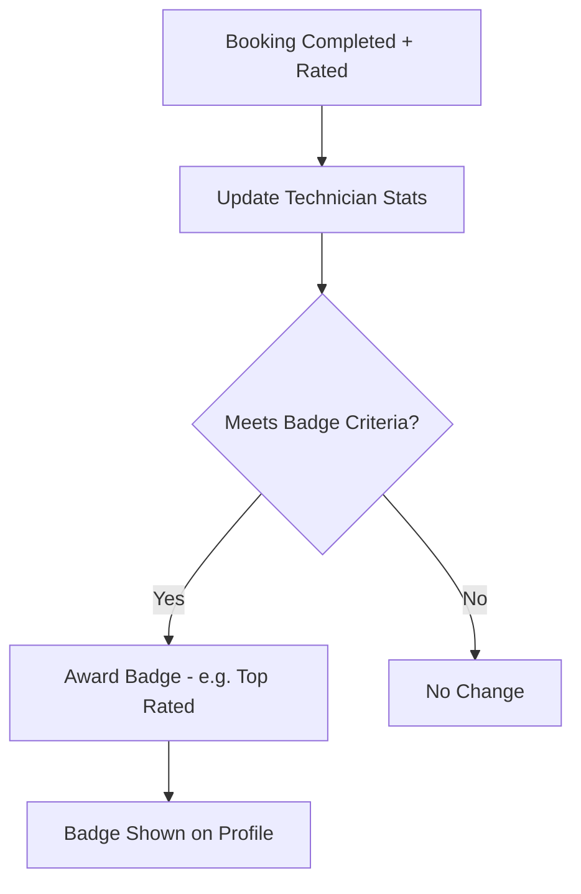
