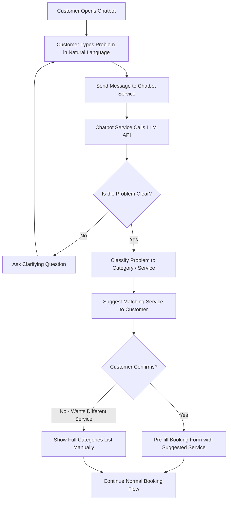

# Osta Platform – Future Enhancements & Roadmap

توثيق لمقترحات تطوير إضافية على منصة Osta، متقسمة حسب الأولوية وصعوبة التنفيذ، بالإضافة إلى الـ Flow المقترح لميزة الـ AI Chatbot.

---

## 1. AI-Powered Chatbot (Smart Intake Bot)

### الفكرة

بدل ما العميل يختار الـ Category والـ Service يدويًا، يكتب مشكلته بلغة طبيعية (مثلاً: "عندي تسريب مياه تحت الحوض")، والبوت يفهم المشكلة، يحددها Automatically، ويوجه العميل مباشرة لطلب الحجز المناسب — مع إمكانية طرح أسئلة توضيحية لو المشكلة مش واضحة.

### القيمة التقنية

- بيدمج بين تخصص الـ Backend (.NET) ومجال الـ AI في نفس المشروع.
- بيوضح قدرة على التكامل مع LLM API خارجي (Claude API / OpenAI API) داخل نظام Production حقيقي.
- بديل أبسط تقنيًا: نموذج Classification مُدرَّب محليًا (Text Classification) بدل الاعتماد الكامل على LLM API.

### Flow

### ملاحظات تصميمية

- ممكن تسجل كل محادثة في جدول `ChatbotConversation` عشان تتحلل لاحقًا وتحسّن دقة الاقتراحات.
- لو الثقة (Confidence Score) بتاعة التصنيف واطية، البوت لازم يسأل سؤال توضيحي بدل ما يخمّن.
- ممكن يتوسع لاحقًا لبوت Support عام (FAQ) يرد على أسئلة زي "إزاي ألغي طلب؟" من غير ما يحتاج LLM حقيقي، مجرد Intent Matching بسيط.

---

## 2. Quick Wins (تنفيذ سهل نسبيًا – قيمة فورية)

| # | الميزة | الوصف | ليه مهمة |
|---|--------|-------|----------|
| 1 | Coupons & Discounts | نظام كوبونات خصم مرتبط بالـ Booking | يضيف Business Logic وقواعد تحقق (Validation Rules) |
| 2 | Favorites | حفظ العميل لفنيين مفضلين (Entity موجود بالفعل في التخطيط) | Entity + Relation بسيطة وسريعة التنفيذ |
| 3 | Push Notifications الفعلية | تفعيل الإشعارات عن طريق Firebase مربوطة بالـ RabbitMQ Consumer الحالي | استكمال منطقي لما هو موجود بالفعل |
| 4 | Localization (AR/EN) | دعم لغتين في الـ API Responses | مهم جدًا لسوق مصر ولمعايير الـ Production APIs |

---

## 3. Medium Complexity (عمق تقني أعلى)

| # | الميزة | الوصف | ليه مهمة |
|---|--------|-------|----------|
| 1 | Real-time Chat | محادثة مباشرة بين العميل والفني عبر SignalR | يضيف مفهوم WebSockets للـ Portfolio |
| 2 | Live Tracking | تتبع موقع الفني لحظيًا على الخريطة (زي Uber) | GPS + SignalR + Google Maps API |
| 3 | Recommendation Engine | اقتراح أقرب فني متاح حسب الموقع والتقييم | حساب مسافات (Haversine) أو PostGIS |
| 4 | Wallet System | رصيد داخلي للعميل بدل الدفع كل مرة | منطق مالي إضافي (Transactions, Balance) |
| 5 | Redis Caching | تسريع قراءة الـ Categories/Services المتكررة | مفهوم Caching أساسي في أي نظام Production |

---

## 4. Advanced (مستوى Production حقيقي)

| # | الميزة | الوصف | ليه مهمة |
|---|--------|-------|----------|
| 1 | Outbox Pattern مع RabbitMQ | ضمان عدم فقد الرسائل لو السيرفر وقع لحظة النشر | نقطة قوية جدًا في مقابلات الشغل (Reliability) |
| 2 | CI/CD Pipeline | بناء واختبار ونشر الـ Docker Image تلقائيًا عبر GitHub Actions | يوضح خبرة DevOps أساسية |
| 3 | Rate Limiting / API Gateway | حماية الـ APIs وتجهيز لتحول محتمل لـ Microservices | مهم لو المشروع اتكبر |
| 4 | Background Jobs (Hangfire) | تذكير بالمواعيد، تقارير دورية للـ Admin | Async Processing بعيدًا عن RabbitMQ |
| 5 | Gamification | Badges للفنيين الأعلى تقييمًا (Top Rated, Fast Responder) | تحسين تفاعل المستخدمين (Engagement) |

---

## 5. الترتيب المقترح للتنفيذ (Roadmap)

```mermaid
flowchart LR
    subgraph Phase1[Phase 1 - Quick Wins]
        A1[Favorites]
        A2[Coupons]
        A3[Localization]
        A4[Push Notifications]
    end

    subgraph Phase2[Phase 2 - AI Layer]
        B1[Chatbot - Smart Intake]
    end

    subgraph Phase3[Phase 3 - Real-time Layer]
        C1[SignalR Chat]
        C2[Live Tracking]
        C3[Recommendation Engine]
    end

    subgraph Phase4[Phase 4 - Production Hardening]
        D1[Outbox Pattern]
        D2[CI/CD Pipeline]
        D3[Rate Limiting]
        D4[Background Jobs]
    end

    Phase1 --> Phase2 --> Phase3 --> Phase4
```

### تبرير الترتيب

1. **الأول Quick Wins** — عشان تبني Momentum وتكمل ميزات ناقصة في الـ Core نفسه.
2. **بعدين الـ Chatbot** — بيضيف قيمة مميزة كبيرة نسبة لمجهود التنفيذ، ويظهر تخصصك في الـ AI.
3. **بعدين Real-time Layer** — تعقيد تقني أعلى، وبيبني على استقرار الـ Core.
4. **آخر حاجة Production Hardening** — دي حاجات بتتضاف لما يكون عندك نظام مستقر وعايز تديله طابع Enterprise-level.
