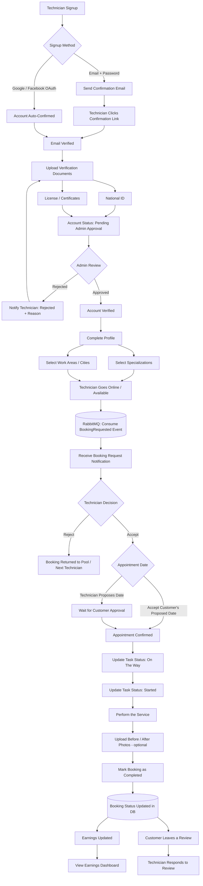
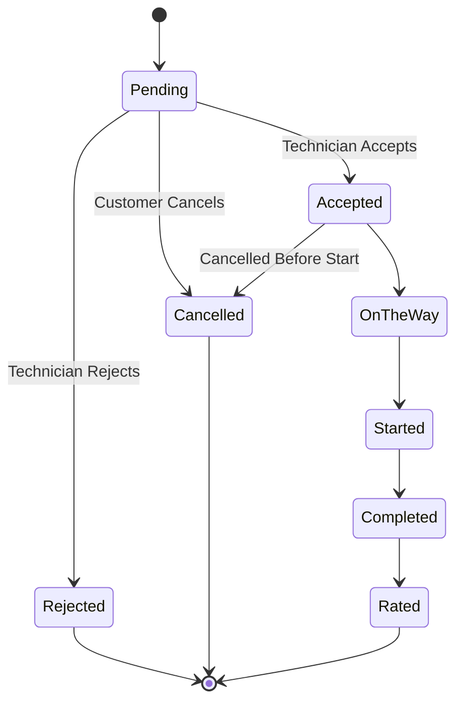

# Osta Platform – Technician Flow

توثيق لرحلة الفني (Technician) من الـ Signup لحد استلام الأرباح والرد على التقييمات.

## 1. Flowchart

## 2. Booking Status – State Diagram (Technician Side)

## 3. Notes / Business Rules

- الفني منيتفعّلش أوتوماتيك بعد الـ Signup — لازم يرفع المستندات (بطاقة الرقم القومي + رخصة/شهادات) ويستنى موافقة الـ Admin.
- لو الـ Admin رفض، الفني بيتبلّغ بالسبب ويقدر يرفع مستندات تاني (يرجع لخطوة الـ Upload).
- بعد الموافقة، الفني لازم يحدد التخصصات (Specializations) ومناطق العمل (Work Areas) قبل ما يظهر في نتائج البحث للعملاء.
- الفني بيستقبل طلبات الحجز عن طريق RabbitMQ Consumer (نفس الـ Event اللي اتنشر من الـ Booking Service وقت الـ Booking Request).
- **Business Rule مهمة:** الفني مايقدرش يقبل طلبين (Bookings) في نفس التوقيت (Overlapping Time Slot) — لازم يتعمل Check على مواعيده الحالية قبل الـ Accept.
- تحديث حالة المهمة (On The Way → Started → Completed) بيحصل من الفني نفسه، وده اللي بيغذي حالة الـ Booking في قاعدة البيانات.
- بعد الإكمال، الأرباح بتتحدث تلقائي في حساب الفني، ويقدر يشوفها في Earnings Dashboard.
- بعد ما العميل يقيّم الخدمة، الفني يقدر يرد على التقييم (Reply on Review).
