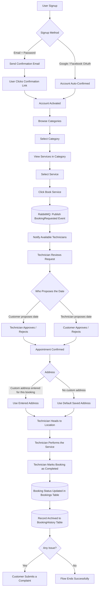
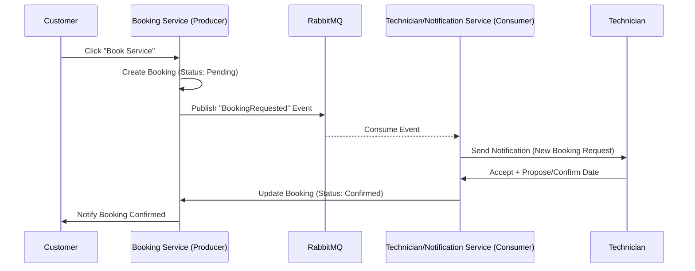

# Osta Platform – Customer Booking Flow

توثيق لرحلة المستخدم (Customer Journey) من الـ Signup لحد الـ Booking History، شامل نقطة الـ RabbitMQ.

## 1. Flowchart

## 2. RabbitMQ Sequence (Booking Event)

## 3. Notes / Assumptions

- الافتراض إن الـ Signup ممكن يبقى عن طريق Email/Password (محتاج Email Confirmation) أو عن طريق Google/Facebook OAuth (يبقى الحساب Verified تلقائيًا).
- الـ RabbitMQ بتشتغل في لحظة الـ Booking Request (Producer = Booking Service, Consumer = Technician/Notification Service) عشان تبلّغ الفنيين المتاحين من غير ما الـ Booking Service يستنى Response مباشر (Async communication).
- الـ Appointment ممكن يتحدد من الكستمر أو من التكنيكال، والطرف التاني يوافق أو يرفض.
- العنوان: لو الكستمر دخل عنوان مخصص للحجز ده يتستخدم، لو مفيش يترجع للعنوان الافتراضي المتخزن في البروفايل بتاعه.
- بعد ما التكنيكال يخلص الشغل، هو اللي يأكد الإتمام في الـ Booking Table، وبعدين السجل يترحّل لجدول الـ BookingHistory.
- في الآخر الكستمر ممكن يفتح Complaint لو حصلت مشكلة.

> ملاحظة: الملف ده Markdown عادي وفيه Mermaid diagrams بتترسم أوتوماتيك على GitHub من غير أي إعدادات إضافية.
